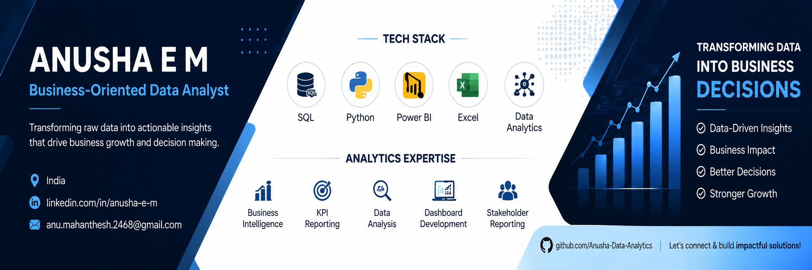

# Hi, I'm Anusha 👋

**Data Analyst | Business Analytics | SQL | Python | Power BI | KPI Reporting**

  

## Professional Identity

Business-Oriented Data Analyst with around 2 years of experience transforming business data into actionable insights through SQL, Python, Power BI, and Excel.

I specialize in end-to-end analytics, including data cleaning, exploratory data analysis, KPI reporting, dashboard development, and stakeholder-focused business analysis. My approach combines technical analysis with business understanding to identify opportunities, solve operational challenges, and support data-driven decision-making.

I enjoy building analytics solutions that not only answer business questions but also provide practical recommendations that organizations can implement to improve performance.

---

## Mission

To transform raw business data into meaningful insights that enable organizations to make informed decisions, improve operational efficiency, and achieve measurable business outcomes through analytics, business intelligence, and data-driven problem solving.

---

## Current Focus

* Building an end-to-end Business Analytics portfolio centered around real-world business problems.
* Developing consulting-style analytics case studies using SQL, Python, Power BI, and Excel.
* Strengthening business storytelling, stakeholder communication, and executive reporting skills.
* Expanding expertise in business analytics, KPI analysis, customer behavior analysis, and decision support.

---

## Career Goals

I am seeking opportunities where I can contribute as a Data Analyst or Business Analyst by solving business problems through data analysis, business intelligence, reporting automation, and decision support. My long-term objective is to become a trusted analytics professional who bridges the gap between business strategy and data-driven decision-making.

---

## Business Mindset

I believe analytics creates value only when it solves real business problems. My approach begins with understanding the business context, identifying stakeholder objectives, defining meaningful KPIs, and using data to support practical decision-making.

Rather than focusing solely on dashboards or reports, I aim to uncover insights that help organizations improve operational efficiency, optimize performance, understand customer behavior, monitor business health, and drive measurable outcomes. Every analysis I perform is guided by the question: **"How can this help the business make a better decision?"**

---

## Technical Expertise

My technical expertise spans the complete analytics lifecycle, from data preparation to business reporting and decision support. I leverage SQL for querying and transforming data, Python for data analysis and exploratory analytics, Power BI for interactive dashboard development and business analysis.

I have experience working with large datasets, performing data cleaning, exploratory data analysis (EDA), KPI analysis, trend analysis, customer segmentation, revenue analysis, and developing dashboards that communicate insights effectively to stakeholders. My focus is on building scalable, well-documented analytics solutions that translate complex data into clear business recommendations.

---

## Core Skills

* Business Analytics
* Data Analysis
* Business Intelligence
* SQL Querying & Data Manipulation
* Python for Data Analysis
* Power BI Dashboard Development
* Exploratory Data Analysis (EDA)
* Data Cleaning & Data Preparation
* KPI & Performance Analysis
* Business Reporting
* Data Visualization
* Customer & Revenue Analytics
* Stakeholder Reporting
* Business Problem Solving

---

## Tech Stack

### 📊 Data Analysis & Business Intelligence

* SQL
* Python
* Power BI
* Microsoft Excel

### 🗄️ Databases

* MySQL

### 📚 Python Libraries

* Pandas
* NumPy
* Matplotlib
* Seaborn

### 📈 Data Visualization

* Power BI
* Matplotlib
* Seaborn

### 🛠️ Development Environment

* Jupyter Notebook

### 🔧 Version Control

* Git
* GitHub

---

## Tools

| Category                 | Tools                                |
| ------------------------ | ------------------------------------ |
| 📊 Business Intelligence | Power BI                             |
| 🗄️ Database              | MySQL                                |
| 💻 Programming           | Python                               |
| 📈 Data Analysis         | Python                               |
| 📓 Development           | Jupyter Notebook                     |
| 🔄 Version Control       | Git, GitHub                          |
| 📋 Documentation         | Microsoft Word, Microsoft PowerPoint |

---

## Analytics Specialties

* 📈 Business Analytics
* 📊 Business Intelligence & Dashboard Development
* 📉 Exploratory Data Analysis (EDA)
* 📋 KPI & Performance Analysis
* 💰 Revenue & Sales Analytics
* 👥 Customer & User Behavior Analysis
* 🎯 Customer Segmentation
* 📑 Business Reporting & Reporting Automation
* 🧹 Data Cleaning & Data Preparation
* 📊 Data Visualization & Storytelling
* 📌 Decision Support Analytics
* 🔍 Root Cause Analysis
* 📈 Trend & Performance Analysis
* 🏢 Stakeholder-Focused Business Insights

---

## Featured Projects

### 🚀 EduMax – End-to-End Business Analytics (Flagship Project)

A consulting-style business analytics project simulating real-world challenges faced by an EdTech organization. The project covers the complete analytics lifecycle, including data cleaning, SQL analysis, Python-based exploratory data analysis, KPI tracking, customer segmentation, revenue analysis, learner engagement analysis, executive dashboard development, and business recommendations to support strategic decision-making.

---

### 💼 Professional Experience (2+ Years)

Applied analytics in a professional environment by developing KPI reports, sales performance analysis, reporting automation, dashboard solutions, and business insights using SQL, Python, Power BI, and Excel. Worked with stakeholders to translate business requirements into analytical solutions that support operational and strategic decision-making.

---

